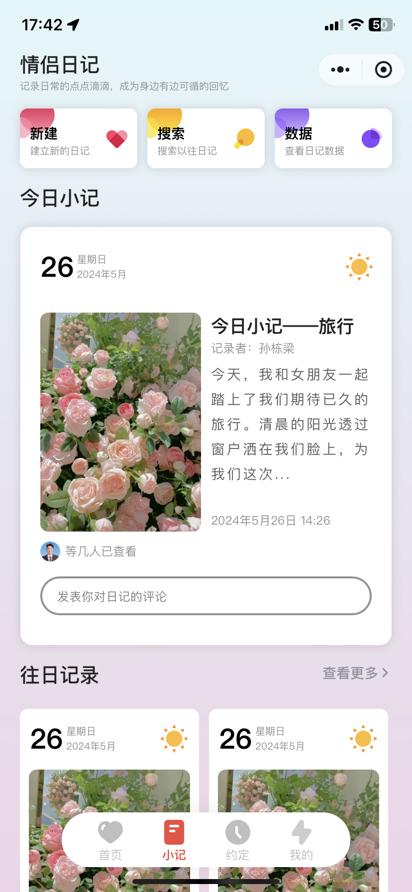

# S-LOVE-MP-WEIXIN

#### 介绍
**以下是 S-LOVE 系统说明**

S_LOVE前端采用uniapp多端开发框架进行开发，目前已适配H5、微信小程序版本

#### 开发进度

1.  首页界面（已完成）
2.  日记界面（已完成）
3.  约定界面（5-29）
4.  我的界面（5-29）
5.  发布日记（5-30）
6.  添加约定（5-30）
7.  留言板（5-31）
8.  相册界面（6-1）

[点击添加功能需求](https://work.weixin.qq.com/kfid/kfc2a819d5c4e03f357)
参与功能需求贡献可优先获得体验版本

#### UI截图

 

#### 参与贡献

1.  [@孙栋梁](https://work.weixin.qq.com/kfid/kfc2a819d5c4e03f357)

